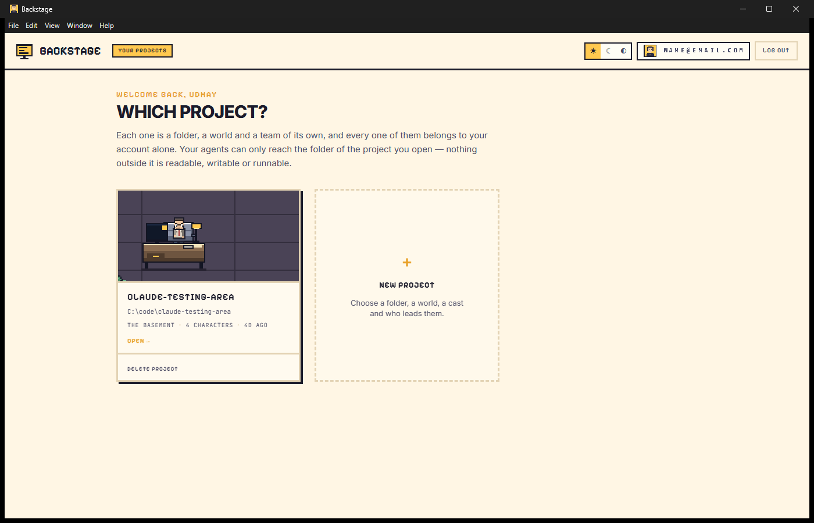

<div align="center">


# Backstage

### Give your AI agents a place to work.

**Backstage turns AI agents into a visual development team working inside your real project workspace.**

<br />

[](https://github.com/sup-Udh/backstage/releases/latest)
[](https://github.com/sup-Udh/backstage/actions/workflows/release.yml)
[](https://github.com/sup-Udh/backstage/releases)


[](LICENSE)

<br />

### [⬇ Download for Windows](https://github.com/sup-Udh/backstage/releases/download/v1.0.0-beta.1/Backstage-Setup-1.0.0-beta.1.exe)

<sub><b>v1.0.0-beta.1</b> · 96.6 MB · Windows 10/11 64-bit · unsigned beta</sub>

</div>

<br />

> [!WARNING]
> **This is an early beta.** Expect bugs and incomplete features. It is not
> production-stable, it is not code-signed, and Windows is the only supported
> platform. [Tell me what breaks →](https://github.com/sup-Udh/backstage/issues)

<br />



---

## What is Backstage?

Most AI coding tools give you a chat box and a diff. Backstage gives you a
**place**.

You point it at a folder on your computer. That folder becomes a project — with
a world, a team, and a cast of agents who live in it. They read, write and run
things inside that folder and nowhere else. And instead of watching a wall of
log output, you watch **characters at desks**: walking to their workstation,
changing pose with whatever they're actually running, turning to face each other
when they talk.

The pixel office isn't decoration. It's the status display. A glance tells you
who is working, who is stuck, and who is waiting on you.

Your source code never leaves your machine.

---

## Features

| | |
|:--|:--|
| 🗂️ **Project-scoped workspaces** | A project is a folder, a world and a team of its own. Agents reach only the folder you have open — nothing outside it is readable, writable or runnable. |
| 👥 **A cast of agents** | Spawn characters with roles. Each gets its own desk, its own tools and its own permissions. |
| 🤝 **Multi-agent collaboration** | Agents delegate to each other, run as a team, and report back into one reconstructed timeline. One worker failing doesn't sink the run. |
| 💬 **Group chats** | Talk to several agents at once — or let them talk to each other. |
| ⏰ **Automations** | Daily, weekly, interval and event triggers. Describe the job in plain English; Backstage compiles it into a schedule. |
| 🔐 **Permissions & Auto Allow** | Every impactful action is gated. Auto Allow is a convenience layer over those rules, never a way around them — anything unrecognised counts as impactful. |
| 🖥️ **Integrated terminal** | Real PTY sessions, scoped to the open project. |
| 🧠 **Claude Code integration** | Detected on your PATH automatically. Real sessions against your project. |
| 🎨 **Six themes** | office · lab · detective · sherlock · friends · stranger |
| 🌗 **Light & dark** | Follows your system by default. |

### Providers

| Provider | Role | Status in this beta |
|---|---|---|
| **OpenAI** | Agent reasoning & chat | ✅ Supported — the most exercised path |
| **Google Gemini** | Agent reasoning & chat | ✅ Supported — less exercised than OpenAI |
| **Claude Code** | Real CLI sessions | ✅ Supported — auto-detected on PATH |

You bring your own API keys. They're stored per-user in an encrypted credential
store, never bundled into the app, and never sent anywhere except to the
provider they belong to.

---

## Download

<div align="center">

| Artifact | Size | Notes |
|---|---:|---|
| **[Backstage-Setup-1.0.0-beta.1.exe](https://github.com/sup-Udh/backstage/releases/download/v1.0.0-beta.1/Backstage-Setup-1.0.0-beta.1.exe)** | 96.6 MB | Installer — recommended |
| **[Backstage-Portable-1.0.0-beta.1.exe](https://github.com/sup-Udh/backstage/releases/download/v1.0.0-beta.1/Backstage-Portable-1.0.0-beta.1.exe)** | 96.4 MB | No install required |

</div>

**Requirements:** Windows 10 or 11, 64-bit · ~356 MB on disk once installed ·
no admin rights needed (installs per-user to `%LOCALAPPDATA%\Programs\Backstage`)

### ⚠️ "Windows protected your PC"

This beta is **unsigned**, so SmartScreen will warn you on first run. That
warning is accurate — Windows genuinely cannot verify who published this.

To continue: **More info → Run anyway**

Want to check the download first? Every release ships a SHA-256 checksum:

```powershell
Get-FileHash .\Backstage-Setup-1.0.0-beta.1.exe -Algorithm SHA256
```

<details>
<summary>Expected checksums for v1.0.0-beta.1</summary>

```
c4bcd922c459456517983ba1c29c673f5cf95eef5a2b9154b977339bf75f85a5  Backstage-Setup-1.0.0-beta.1.exe
5d9d4ba14c8756a6964916dbd712cea2f2fd13d1cb0a51d76310507aafcb9a6a  Backstage-Portable-1.0.0-beta.1.exe
```

Also published as `.sha256` files on the
[release page](https://github.com/sup-Udh/backstage/releases/tag/v1.0.0-beta.1).

</details>

---

## First run

```
1.  Sign in            Google account
2.  Connect a provider Paste an OpenAI or Gemini API key in Account
3.  Create a project   Point it at a real folder on your machine
4.  Spawn agents       Give them something to do
```

Claude Code, if installed and on your PATH, is picked up automatically —
nothing else to configure.

---

## Under the hood

<div align="center">

| | |
|---:|:---|
| **115** | commits |
| **296** | tracked files |
| **60,231** | lines of TypeScript / TSX |
| **259** | source files |
| **18** | test files |
| **881** | test assertions, all green |
| **6** | themes |
| **1** | contributor |

<sub>First commit 18 Aug 2026 · first release 30 Aug 2026</sub>

</div>

### Where the code lives

| Area | Lines | Files | What it does |
|---|---:|---:|---|
| `src/` | 37,645 | 159 | React renderer — pages, components, the pixel world |
| `agents/` | 9,810 | 39 | Orchestration, automations, permissions, group chats |
| `ipc/` | 2,084 | 8 | Main↔renderer bridge |
| `supabase/` | 2,022 | 8 | Auth, session, sync |
| `terminal/` | 1,928 | 10 | PTY sessions, Claude Code detection |
| `tools/` | 1,787 | 10 | What agents are allowed to do |
| `providers/` | 1,433 | 7 | OpenAI + Gemini adapters |
| `test/` | 1,047 | 4 | Integration suites |
| `projects/` | 914 | 4 | Project rules and isolation |
| `workspace/` | 452 | 4 | File watching, awareness |

### Built with

**Electron 37.10.3** · **React 19.2** · **TypeScript 5.9** · **Vite 7.3** ·
**Tailwind 4.3** · **Zustand 5.0** · **xterm.js 6.0** · **node-pty** ·
**Supabase** · packaged with **electron-builder 26.15**

---

## Build from source

```bash
git clone https://github.com/sup-Udh/backstage.git
cd backstage
npm ci

npm run dev          # development, hot reload
npm run typecheck    # tsc --noEmit
npm test             # 881 assertions across 18 suites
npm run build        # production bundles → out/
npm run package      # unpacked app  → release/win-unpacked
npm run dist         # installer + portable → release/
```

Signing in needs a Supabase project. Copy `.env.example` to `.env` and fill in
the **public** pair — project URL and anon/publishable key. Full walkthrough in
[SUPABASE_GOOGLE_AUTH_SETUP.md](SUPABASE_GOOGLE_AUTH_SETUP.md).

> **Never** put a `SUPABASE_SERVICE_ROLE_KEY` in that file. It bypasses every
> row level security policy in the database. Backstage has no code path that
> reads it and warns on startup if it finds one.

> [!TIP]
> Close any running Backstage that has this repo open as its project before
> `npm run dist`. Its file watcher holds a handle on `release/`, and Windows
> can't rename a directory that's being watched — the build fails with `EPERM`.

---

## Known limitations

Being straight with you about what you're downloading:

- **Unsigned build** — SmartScreen warns on first run. Fixing this needs a code
  signing certificate ([what that takes](CODE_SIGNING_SETUP.md)).
- **Windows only** — no macOS or Linux build. Packaging config for both exists
  but has never been built or tested.
- **No auto-update** — updating means running the next installer by hand. The
  `latest.yml` manifest an updater needs already ships
  ([the plan](AUTO_UPDATE_PLAN.md)).
- **Gemini is less exercised than OpenAI** — fully wired, with adapter tests,
  but OpenAI has the most real use behind it. Try OpenAI first if something
  misbehaves.
- **Google sign-in only** — no email/password, no other identity providers.
- **Agent behaviour is beta** — long or unusual tasks can produce partial or
  confused results. Permissions are the backstop; read what you approve.
- **Provider calls weren't exercised end-to-end in release QA** — install,
  launch, branding, session persistence, project loading and Claude Code
  detection were all verified against the packaged build. Live OpenAI/Gemini
  completions need your own key and weren't run against the artifact.

---

## Documentation

| Document | Covers |
|---|---|
| [CHANGELOG.md](CHANGELOG.md) | What changed, per version |
| [RELEASE_NOTES_v1.0.0-beta.1.md](RELEASE_NOTES_v1.0.0-beta.1.md) | This release in full |
| [RELEASE_CHECKLIST.md](RELEASE_CHECKLIST.md) | What gets verified before shipping |
| [DOWNLOAD_RELEASE_SETUP.md](DOWNLOAD_RELEASE_SETUP.md) | Wiring the website download button |
| [CODE_SIGNING_SETUP.md](CODE_SIGNING_SETUP.md) | Why this build is unsigned, and what signing needs |
| [AUTO_UPDATE_PLAN.md](AUTO_UPDATE_PLAN.md) | How auto-update gets switched on |
| [SUPABASE_GOOGLE_AUTH_SETUP.md](SUPABASE_GOOGLE_AUTH_SETUP.md) | Auth setup, end to end |
| [USER_PROVIDER_CONFIGURATION.md](USER_PROVIDER_CONFIGURATION.md) | How per-user provider keys work |

---

## Feedback

Bugs, rough edges and "this made no sense to me" are all useful right now.

**[Open an issue →](https://github.com/sup-Udh/backstage/issues)**

If it's a crash, the version from the title bar plus what you were doing is
enough to start.

---

<div align="center">


**[MIT](LICENSE)** © 2026 udhay rajeev

<sub>Built for people who'd rather watch their agents work than read their logs.</sub>

</div>
